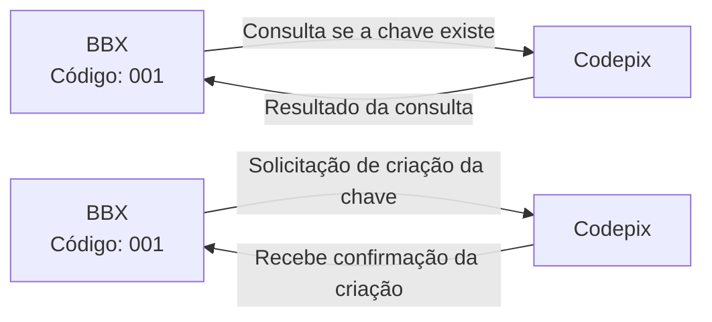
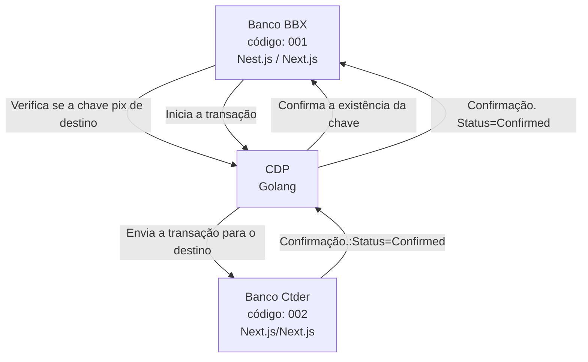
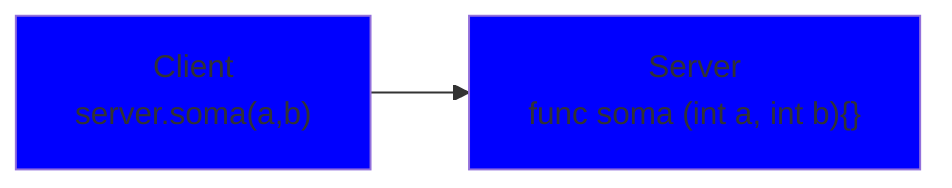
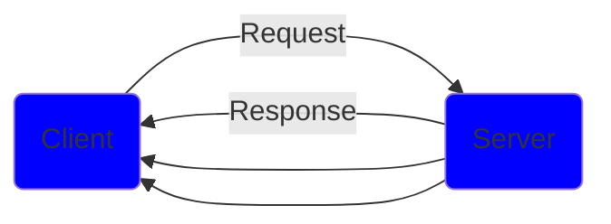
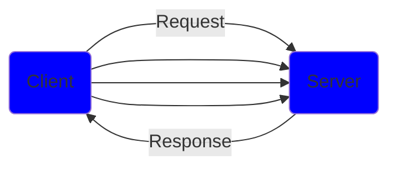
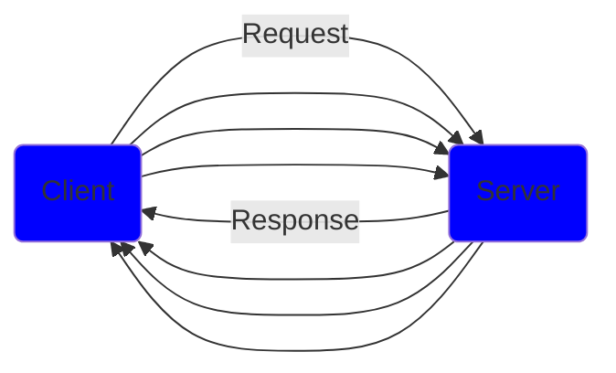

# CodePix

## Sobre a aplcicação

- É uma solução para simular transferências de valores entre bancos fictícios através de chaves (e-mail, CPF).
- Simularemos diversos bancos e contas bancárias que possuem uma chave PIX atribuída.
- Cada conta bancária poderá cadastrar suas chaves Pix.
- Uma conta bancária modera realizar uma transferência para outra conta em outro banco utilizando a chave Pix da conta de destino.
- Uma transação não pode ser perdida mesmo que: o CodePix esteja fora do ar.
- Uma transação não pode ser perdida mesmo que: o Banco de destino esteja fora do ar.

### Sobre os Bancos

- O banco será um microsserviço com funções limitadas a cadastro de contas e chave Pix, bem como transferências de valores.
- Utilizaremos a mesma aplicação para simular diversos bancos, mudando apenas as cores, nome e código.
- Nest.js no Backend.
- Next.js no frontend.

### Sobre o CODEPIX

- o Microserviço CODEPIX será responsável por intermedias as transferências bancárias.
- Receberá a transação de transferência.
- Encaminhará a transação para o banco de destino (Status: PENDING).
- Receberá a confirmação do banco de destino (Status: CONFIRMED).
- Envia confirmação para o banco de origem informando quando o banco de destino processou.
- Recebe a confirmação do banco de origem de que ele processou (Status: COMPLETED ).
- Marca a transação como completa (Status: COMPLETED).

### Cadastro e consulta de chaves Pix



### Dinâmica do processo



### Principais desafios

- Comunicação rápida e eficiente.
- Criação e consulta instantânea das chaves (Síncronas).
- Garantia que nenhuma transação seja perdida, mesmo que qualquer dos 3 estejam fora do ar (Assíncrona).

### Tecnologias Utilizadas

- gRPC
- apache Kafka

### CODEPIX

- será capaz de atuar como um servidor gRPC.
- consumir e publicar mensagens no Apache Kafka.
- Ambas as operações devem ser realizadas de forma simultânea ao executar o serviço.
- Trabalhar com um design focado em solucionar o problema do domínio.
- Deixar a complexidade técnica para "camada de aplicação", responsável pelo servidor gRPC e Kafka.

### Arquitetura Hexagonal / Ports and Adaprters

Utilizar padrões existentes para criar aplicações. Desenvolver software sustentável.

- Crescimento sustentável.
- Manutenção.
- A complexidade inicial se paga ao longo do projeto.
- O seu software deve ser definido e desenhado por você e não pelo seu framework.
- As peças têm que se encaixar, mas eventualmente podem ser substituídas ou adicionadas.

### O que é gRPC

- gRPC é um framework desenvolvido pela google que tem o objetivo de facilitar o processo de comunicação entre sistemas de uma forma extremamente rápida, leve, independente de linguagem.
- Faz parte da CNCF (Cloud Native Computation Foundation)

### Em quais casos podemos utilizar

- Ideal para microsserviços
- Mobile, Browser e Backend
- Geração das bibliotecas de forma automática
- Streaming bidirecional utilizando HTTP/2

### Linguagens (Suporte oficial)

- gRPC-GO
- gRPC-Java
- gRPC-C
  - C++
  - Python
  - Ruby
  - Objective-C
  - PHP
  - C#
  - Node.js
  - Dart
  - Kotlin/JVM

## RPC - Remote Procedure Call



### Protocol Buffers

"Protocol buffers are Google's language-neutral, platform-neutral, extensible machanism for serializing structure data - Think XML, but smaler, faster and simple"

#### Protocol Buffers vs JSON

- Arquivo binário < JSON
- Processo de serialização é mais leve (CPU) que JSON
- Gasta menos recursos de rede
- Processo é mais veloz

#### *Sintaxe*

```proto3
syntax="proto3";

message SearchRequest (
 string query = 1;
 int32 page_number = 2;
 int32 result_per_page = 3;

)

```

## HTTP/2

- Nome original era SPDY
- Lançado em 2015
- Dados trafegados são binários e não texto como o HTTP 1.1
- Utiliza a mesma conexão TCP para enviar e receber dados do cliente e do servidor ( Multiplex )
- Server Push
- Headers são Comprimidos
- Gasta menos recursos de rede
- Processo é mais veloz

## gRPC - API "unary"



## gPRC - API "Client streaming"



## gPRC - API "Bi Direcional streaming"



### REST vs gRPC

#### REST

- Texto / JSON
- Unidirecional
- Alta latência
- Sem contrato ( maior chance de erros )
- Sem suporte a streaming
- Design pré-definido
- Bibliotecas de terceiros

#### gRPC

- Protocol Buffers
- Bidirecional e Assíncrono
- Baixa latência
- Contrato definido (.proto)
- Suporte a Streaming
- Design é livre
- Geração de código
